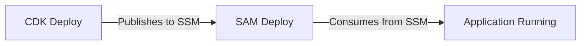

# BANCOW Infrastructure

Infrastructure as Code (IaC) repository for BANCOW platform using AWS CDK for base infrastructure and AWS SAM for application resources.

## 🏗️ Architecture Overview

This repository is structured to separate **stateful base infrastructure** (managed by CDK) from **application resources** (managed by SAM):

```
bancow-infra/
├── cdk/                         # Base Infrastructure (CDK)
│   ├── bin/
│   │   └── bancow-infra.ts     # CDK entry point
│   ├── lib/
│   │   ├── network/
│   │   │   └── vpc-stack.ts    # VPC, subnets, routing, endpoints
│   │   ├── iam/
│   │   │   └── iam-stack.ts    # IAM roles, OIDC, boundaries
│   │   ├── s3/
│   │   │   └── s3-stack.ts     # S3 buckets (artifacts, logs, data)
│   │   ├── security/
│   │   │   └── kms-stack.ts    # KMS encryption keys
│   │   └── bancow-base-stack.ts # Orchestrator stack
│   ├── package.json
│   ├── tsconfig.json
│   └── cdk.json
│
├── sam/                         # Application Infrastructure (SAM)
│   ├── resources/
│   │   ├── root.yaml           # Root stack (nested stacks)
│   │   ├── app.yaml            # Lambda functions
│   │   ├── apigw.yaml          # API Gateway, WAF
│   │   └── data.yaml           # App-level data resources
│   ├── environments/
│   │   ├── dev/parameters.json
│   │   ├── uat/parameters.json
│   │   └── prod/parameters.json
│   └── samconfig.toml
│
├── .github/workflows/
│   └── deploy-infra.yml        # CI/CD pipeline (CDK → SAM)
│
└── README.md                    # This file
```

## 🔑 Ownership Rules (CRITICAL)

### ❌ NEVER

- **Never deploy infrastructure from `bancow-app` repository**
- **Never create VPC, IAM base roles, or shared S3 buckets in SAM**
- **Never skip CDK deployment before SAM**

### ✅ ALWAYS

- **Always deploy CDK before SAM**
- **CDK publishes outputs to SSM Parameter Store**
- **SAM consumes base resources from SSM**
- **All infrastructure changes happen in `bancow-infra` repository**

## 🚀 Deployment Process

### Prerequisites

1. **AWS Account** with appropriate permissions
2. **GitHub Secrets** configured:
   - `AWS_DEPLOY_ROLE_ARN`: IAM role ARN for OIDC authentication
3. **Existing base resources** (VPC, S3 buckets, KMS keys) created by legacy CloudFormation

### Deployment Order



### 1. CDK Base Infrastructure

The CDK stack **imports existing resources** and publishes their IDs/ARNs to SSM Parameter Store:

```bash
cd cdk
npm install
npm run build

# Synthesize and review
npm run synth -- -c environment=dev

# Deploy to specific environment
npm run deploy -- -c environment=dev -c githubOrg=your-org -c githubRepo=bancow-infra
```

**What CDK Does:**
- Imports existing VPC, subnets, security groups
- Imports existing S3 buckets (artifacts, logs, data)
- Imports existing KMS keys
- Creates/updates OIDC provider for GitHub Actions
- Creates deployment roles with permission boundaries
- Publishes all resource IDs to SSM at `/{project}/{env}/*`

### 2. SAM Application Resources

SAM consumes base infrastructure from SSM and deploys application resources:

```bash
cd sam

# Validate templates
sam validate --template resources/root.yaml --lint

# Build
sam build --template resources/root.yaml --use-container

# Deploy to specific environment
sam deploy --config-env dev
```

**What SAM Does:**
- Reads VPC, subnet, KMS, S3 info from SSM
- Creates Lambda functions and API Gateway
- Sets up CloudWatch alarms and logs

## 📋 Environment Configuration

### Environments

- **dev**: Development environment (auto-deploys from `develop` branch)
- **uat**: User Acceptance Testing (manual workflow dispatch)
- **prod**: Production (auto-deploys from `main` branch)

### SSM Parameter Structure

All base infrastructure is published to SSM:

```
/bancow/{env}/
├── network/
│   ├── vpc-id
│   ├── private-subnet-ids
│   ├── public-subnet-ids
│   └── lambda-sg-id
├── iam/
│   ├── github-actions-role-arn
│   ├── lambda-execution-role-arn
│   └── github-oidc-provider-arn
├── s3/
│   ├── artifacts-bucket-name
│   ├── logs-bucket-name
│   └── data-bucket-name
└── kms/
    ├── main-key-id
    └── main-key-arn
```

## 🔧 Local Development

### CDK Development

```bash
cd cdk
npm install
npm run build
npm run test        # Run unit tests
npm run watch       # Watch for changes
```

### SAM Development

```bash
cd sam
sam local start-api --template resources/root.yaml
sam local invoke FunctionName --event events/test.json
```

## 🔐 Security & Compliance

### PCI-DSS Compliance

- All data encrypted at rest (KMS)
- All data encrypted in transit (TLS)
- VPC isolation for Lambda functions
- WAF protection on API Gateway (production)
- Secrets stored in AWS Secrets Manager

### Permission Boundaries

Deployment roles use permission boundaries to prevent:
- Deletion of critical IAM resources
- Modification of organization settings
- Access to other AWS accounts

## 📊 Monitoring & Observability

- **CloudWatch Logs**: All Lambda and API Gateway logs
- **X-Ray Tracing**: Enabled on all Lambda functions and API Gateway
- **CloudWatch Alarms**: API error rate and latency monitoring
- **Metrics**: Custom metrics via Lambda Powertools

## 🛠️ Operations

### Viewing Deployed Resources

```bash
# List CDK stacks
aws cloudformation list-stacks --query "StackSummaries[?contains(StackName, 'bancow')]"

# Get stack outputs
aws cloudformation describe-stacks --stack-name bancow-dev-base

# View SSM parameters
aws ssm get-parameters-by-path --path /bancow/dev/ --recursive
```

### Rollback

```bash
# CDK
cd cdk
npm run deploy -- -c environment=dev --rollback

# SAM
cd sam
sam deploy --config-env dev --no-execute-changeset
```

### Secrets Management

Secrets are stored in AWS Secrets Manager and must be set manually or via CI/CD:

```bash
# Update SOAP credentials
aws secretsmanager update-secret \
  --secret-id bancow-dev-soap-credentials \
  --secret-string '{"username":"user","password":"pass","clientId":"client"}'
```

## 📝 Making Changes

### Adding New Base Infrastructure

1. Add resource to appropriate CDK stack in `cdk/lib/`
2. Publish resource ID/ARN to SSM
3. Deploy CDK: `cd cdk && npm run deploy`
4. Update SAM templates to consume from SSM
5. Deploy SAM: `cd sam && sam deploy`

### Adding New Application Resources

1. Add resource to appropriate SAM template in `sam/resources/`
2. Ensure it consumes base resources from SSM
3. Update `root.yaml` if creating new nested stack
4. Deploy: `cd sam && sam deploy`

### Modifying Existing Resources

1. Update template (CDK or SAM)
2. Test in dev environment first
3. Review changeset before applying
4. Deploy via CI/CD or manually

## 🧪 Testing

### Infrastructure Tests

```bash
# CDK unit tests
cd cdk
npm test

# SAM validation
cd sam
sam validate --template resources/root.yaml --lint
```

### Integration Tests

```bash
# Test API endpoint
curl https://{api-id}.execute-api.us-east-1.amazonaws.com/dev/health
```

## 📚 Documentation

- [AWS CDK Documentation](https://docs.aws.amazon.com/cdk/)
- [AWS SAM Documentation](https://docs.aws.amazon.com/serverless-application-model/)
- [GitHub Actions OIDC](https://docs.github.com/en/actions/deployment/security-hardening-your-deployments/configuring-openid-connect-in-amazon-web-services)

## 🤝 Contributing

1. Create feature branch from `develop`
2. Make changes following the ownership rules
3. Test in dev environment
4. Create pull request
5. Deploy to UAT for validation
6. Merge to `main` for production deployment

## 📞 Support

- **Platform Team**: platform-team@bancow.com
- **On-Call**: Use PagerDuty escalation
- **Documentation**: Confluence BANCOW Space

## ⚠️ Important Notes

- This repository manages **infrastructure only**
- Application code lives in `bancow-app` repository
- Lambda function code is deployed separately
- CDK imports existing legacy CloudFormation resources
- Migration from legacy CloudFormation is gradual

---

**Last Updated**: 2026-01-17  
**Maintained by**: Platform Team  
**License**: Proprietary - BANCOW
